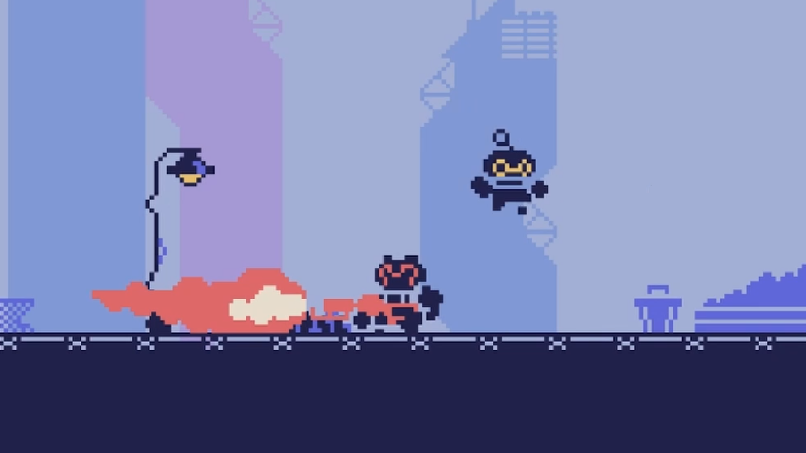

# JavaScript Metroidvania Game

Welcome to the Metroidvania Game! This project is a classic Metroidvania-style game developed using JavaScript and the Kaboom.js library. This README file will guide you through the setup and features of the game.

## Live demo : 

## Table of Contents
1. Introduction
2. Features
3. Installation
4. Gameplay
5. Controls
6. Contributing
7. License

## Introduction

Metroidvania Game is a 2D action-adventure game where players explore a large interconnected world. Players will encounter enemies, find upgrades, and unlock new areas as they progress through the game. The game is inspired by classic Metroidvania titles, combining exploration, platforming, and combat.

## Features

Interconnected World: Explore a vast, interconnected world filled with secrets and hidden areas.
Power-ups and Upgrades: Discover power-ups and upgrades to enhance your abilities and access new areas.
Challenging Enemies: Face off against a variety of enemies, each with unique behaviors and attack patterns.
Platforming Challenges: Navigate through challenging platforming sections requiring precision and skill.
Retro Aesthetic: Enjoy a nostalgic retro aesthetic with pixel art graphics and chiptune music.

## Installation

To run the game locally, follow these steps:

1. Clone the repository: 
git clone https://github.com/yourusername/JS-Metroidvania-Game.git
cd JS-Metroidvania-Game
2. Install dependencies: npm install
3. Run the game: npm start
4. Open your browser and navigate to http://localhost:3000 to play the game.

## Gameplay
In Metroidvania Game, players take on the role of a hero exploring a vast world. The goal is to find and defeat the final boss while uncovering hidden secrets and obtaining power-ups along the way.

1. Exploration: Move through different areas, finding paths to new locations.
2. Combat: Defeat enemies using your primary weapon and abilities.
3. Upgrades: Collect upgrades that enhance your abilities, allowing you to reach previously inaccessible areas.
4. Boss Fights: Engage in challenging boss fights that require strategy and skill.

## Controls

1. Arrow Keys: Move left and right
2. Spacebar: Jump
3. Z: Attack
4. X: Use special ability (if available)
5. C: Interact with objects/NPCs

##Contributing

Contributions are welcome! If you'd like to contribute to the development of Metroidvania Game, please follow these steps:

1. Fork the repository.
2. Create a new branch: git checkout -b feature/your-feature-name
3. Make your changes.
4. Commit your changes: git commit -m "Add your commit message here"
5. Push to your branch: git push origin feature/your-feature-name
6. Create a pull request.

Please ensure your code follows the project's coding standards and includes appropriate tests.

## License

This project is licensed under the MIT License. See the LICENSE file for details.

Enjoy playing Metroidvania Game! If you have any questions or feedback, feel free to open an issue on the GitHub repository.

